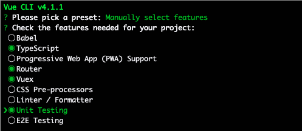
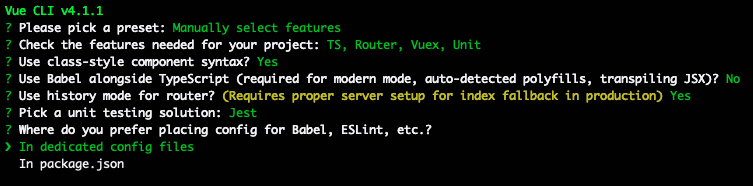

# vue-typescript-admin

## 前序准备
开始本项目之前，需要对以下模块有所了解
- TypeScript：JavaScript超集
- Vue：渐进式Javascript框架
- Vuex：专为Vue应用程序提供的状态管理模式
- Vue Router：Vue官方的路由管理器
- Vue Cli: Vue开发标准工具
- Axios：基于Promise的HTTP客户端
- Element UI：基于Vue的桌面端组件库

## 创建项目
```
# 安装脚手架
npm install -g @vue/cli
# 初始化项目
vue create vue-typescripe-admin
```
过程如图示：



## 目录结构

```
├── public                      # 公共资源目录
├── src                         # main source code
│   ├── assets                 	# 资源目录 (processed by webpack)
│   ├── components             	# 组件目录
│   ├── locals             		  # 本地化
│   ├── model                  	# 结构体
│   ├── plugins                	# vue 插件引入及初始化
│   ├── router                 	# 路由
│   ├── store                  	# vuex数据结构
│   ├── utils                 	# 封装的工具目录
│   ├── views                  	# 页面vue
│   ├── App.vue                	# vue入口
│   ├── main.ts                	# 应用入口
├── tests/                     	# tests
├── .browserslistrc            	# browserslist config file (to support Autoprefixer)
├── .editorconfig              	# editor code format consistency config
├── .env.xxx                   	# env variable configuration
├── .eslintrc.js               	# eslint config
├── babel.config.js            	# babel config
├── cypress.json               	# e2e test config
├── package.json               	# package.json
├── tsconfig.json              	# typescript config
└── vue.config.js              	# vue-cli config
```

## 插件安装
```
# 安装elment ui
yarn add axios@0.19.0
yarn add js-cookie@2.2.1
yarn add vue-svgicon@3.2.6
yarn add element-ui@2.12.0
yarn add path-to-regexp@3.0.0
yarn add vuex-module-decorators@0.10.1

yarn add sass@1.22.10 --dev
yarn add sass-loader@7.3.1 --dev
yarn add @types/js-cookie@2.2.2 --dev
yarn add style-resources-loader@1.2.1 --dev
yarn add vue-cli-plugin-style-resources-loader@0.1.3 --dev

```

## 基本样式
- src/styles/index.scss：全局基本样式
- src/styles/element-variables.scss：Element-ui样式
- src/styles/_transition.scss：动画样式
- src/styles/_svgicon：svg图标样式

## 启动项目
### 开发启动
```
yarn serve
```

### 生产打包
```
yarn build
```

### 单元测试
```
yarn test:unit
```